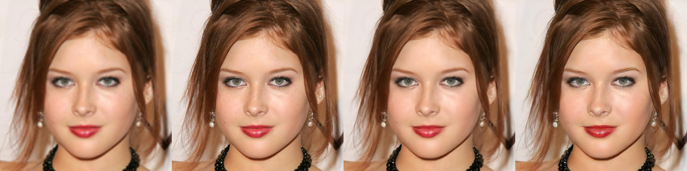

# Super-FAN Pytorch
The PyTorch implement of Super-FAN.
[Super-FAN: Integrated facial landmark localization and super-resolution of real-world low resolution faces in arbitrary poses with GANs](http://openaccess.thecvf.com/content_cvpr_2018/papers/Bulat_Super-FAN_Integrated_Facial_CVPR_2018_paper.pdf)
Based on [SRGAN](https://github.com/leftthomas/SRGAN), I altered the code by adopting Super-FAN network structure. 

## Prerequisites

* Python 3.6
* Pytorch 1.0 or newer

## Dataset

Use the same dataset of [FSRNet](https://github.com/cydiachen/FSRNET_pytorch).Change the option in Train.py to set the dataset's directory. I am using CelebAHQ-MASK as the training set. The GroundTruth is generated by zllrunning/face-parsing.PyTorch(https://github.com/zllrunning/face-parsing.PyTorch) with pretrained model.

Dataset Link: https://pan.baidu.com/s/1HEECUyKI5GOSrd7NPlm-ow  密码:z2ud

## Train and Test

I haved merge the Super-FAN in to the [mmsr](https://github.com/jzijin/mmsr).I use the mmsr hierarchical to pretrain Super-FAN's Generator.the 3000 of the CelebAHQ-MASK used for train with 212000 iter.

Please read the [mmsr](https://github.com/jzijin/mmsr) for training and testing.

## Result
The pretrain model result.
The left to right is bicubic interpolation image, high resolution image, SR image without GAN, SR image with GAN._

